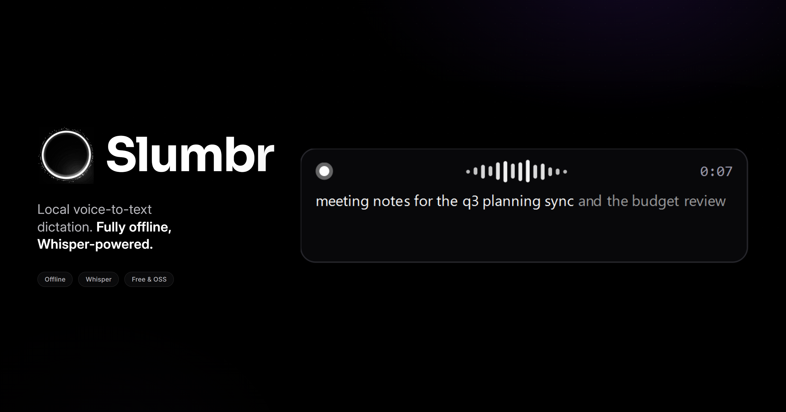
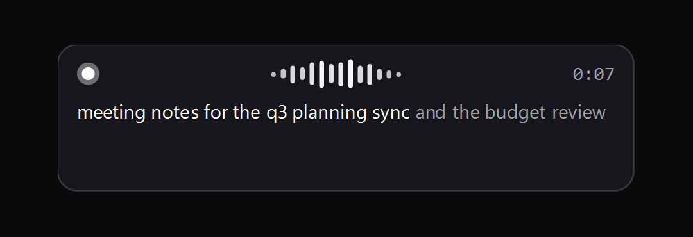
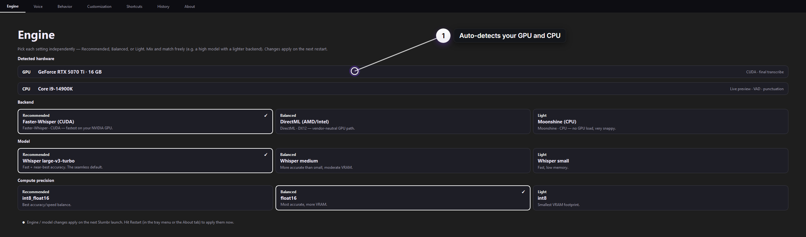
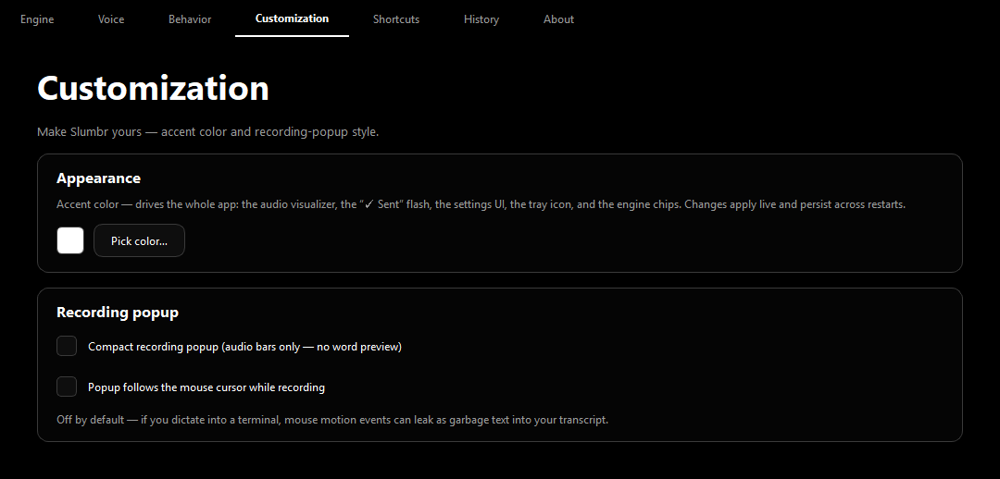
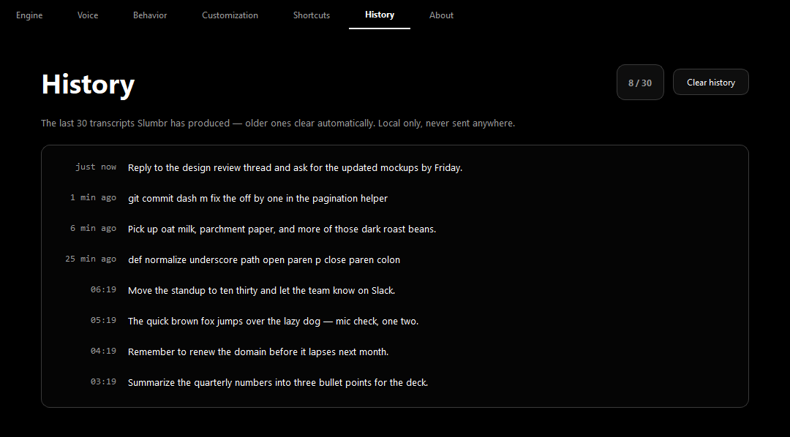
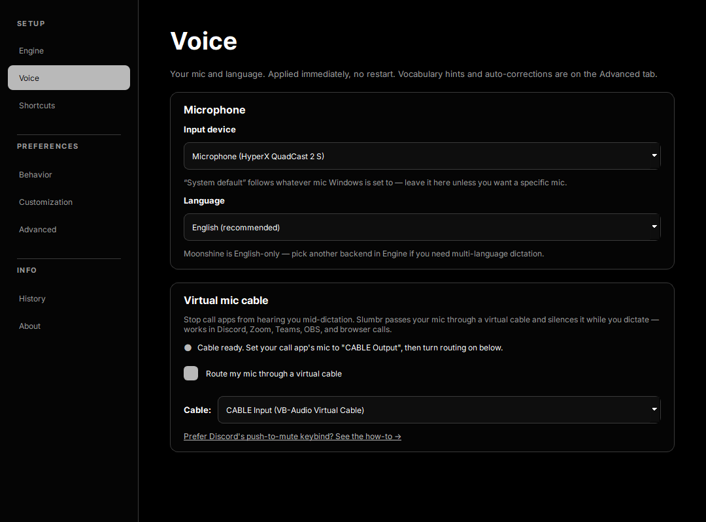

<h1 align="center">Slumbr</h1>

<p align="center">
  
</p>

<p align="center">
  <b>Local, offline, hotkey-driven voice-to-text dictation for Windows.</b><br>
  Tap a key, speak, and your words type into whatever window is focused — fully on-device.
</p>

<p align="center">
  
  
  
  
</p>

Tap **Caps Lock** → a popup appears with a live audio meter and a transcript that grows as you talk → tap **Caps Lock** again → your words land at the cursor. No accounts, no cloud, no telemetry.

## Quick start

1. **Install** — clone the repo and run one PowerShell command (below). No admin needed.
2. **First launch sets itself up** — Slumbr detects your hardware and installs the right speech engine automatically.
3. **Tap Caps Lock, speak, tap again** — your words land wherever your cursor is.

## Install

Slumbr installs **from source** with a single script — a signed one-click installer is on the way as a fast-follow. Windows 10 / 11 (64-bit), no admin required.

```powershell
git clone https://github.com/SIeepyDev/slumbr.git
cd slumbr
.\install.ps1
```

> **PowerShell won't run the script?** Either `Unblock-File .\install.ps1`, or allow local scripts once with `Set-ExecutionPolicy -Scope CurrentUser RemoteSigned`.

`install.ps1` finds Python 3.10–3.12, creates a `.venv`, installs the base runtime, builds the app icon, and drops a Slumbr shortcut on your desktop. On first launch the **setup wizard** probes your hardware and installs the right vendor wheels (~50 MB–1.9 GB depending on backend).

**Pick a backend up front** (optional — the wizard does this for you):

```powershell
.\install.ps1 -Backend nvidia    # NVIDIA CUDA — faster-whisper, large-v3-turbo
.\install.ps1 -Backend amd       # AMD / Intel via DirectML
.\install.ps1 -Backend cpu       # CPU-only — Moonshine
.\install.ps1 -Rebuild           # wipe .venv and start clean
```

**Run it:**

```powershell
.\.venv\Scripts\pythonw.exe -m slumbr        # no console (matches the shortcut)
.\.venv\Scripts\python.exe -m slumbr --debug # with verbose logs
```

> **AMD / Intel GPU?** The DirectML path works from source today. **No GPU?** Moonshine runs great on a modern CPU — nothing extra to install.

## How it works

**1 · Tap, speak — done.** Tap your hotkey and a compact popup appears with a live audio meter and a transcript that grows as you talk. Tap again and your words land at the cursor.



**2 · It picks the right engine for your machine.** On first launch Slumbr probes your hardware and recommends the fastest path — here an RTX 5070 Ti gets Faster-Whisper on CUDA. Backend, model, and precision are three independent picks, so you can mix a high model with a lighter backend.



**3 · Make it yours.** One accent color recolors the whole app — visualizer, settings UI, tray icon — live, and persists across restarts. Tune the popup style too.



**4 · Everything stays local.** Your recent transcripts show in History, newest first — copy any one out or clear them, anytime. When the list fills it rolls into a **Session log** you can dig back into (a fallback for the one that scrolled off), and everything clears when you close Slumbr. Nothing ever leaves your machine.



### Two engines under the hood

Slumbr runs **two ASR engines** in parallel because Whisper isn't streaming-native:

| Engine | Job | Latency |
| --- | --- | --- |
| Moonshine + Silero VAD + online punctuation (CPU, ONNX int8) | Live popup partials while you speak | ~150–300 ms to first word |
| Your chosen backend (CUDA / DirectML / CPU) | Final transcript when you tap off | ~0.4–1 s for a 5 s clip, hardware-dependent |

Models cache to `%APPDATA%\Slumbr\models` on first download — after that, Slumbr makes **zero network calls** at runtime.

## Features

- **Pluggable STT backends, auto-picked per hardware.** First launch probes your GPU and installs only the right runtime:
  - NVIDIA RTX → `faster-whisper` on CUDA (max accuracy + speed)
  - AMD Radeon RX → Whisper via ONNX Runtime DirectML
  - Intel Arc + iGPU → DirectML (SYCL on roadmap)
  - CPU-only → Moonshine (~150–300 ms, snappier than Whisper on CPU)
- **Live partials while you speak.** Moonshine + Silero VAD + online punctuation give the popup smooth word-by-word text that grows monotonically.
- **Tap-to-toggle Caps Lock hotkey.** No press-and-hold, no wake-word. The OS-level Caps Lock state is never flipped while Slumbr is running. Rebind to any key or chord in Settings → Shortcuts.
- **Auto-paste at the cursor.** Works in Notepad, browsers, chat apps, terminals (Ctrl+Shift+V mode), and Electron IDEs like VS Code.
- **Copy from history + session-log fallback.** A dictation that landed with no field focused still saves to History — double-click, right-click, or Ctrl+C to copy any transcript out, or "Copy all". When History fills, the batch rolls into a temporary **Session log** so a transcript that scrolled off is never lost; session logs clear when you close Slumbr. If Slumbr ever closes unexpectedly, it offers to recover the last session.
- **Mute other apps while dictating.** One-click VB-Cable install + auto-config → call apps hear silence during dictation while Slumbr keeps capturing. Works in Discord / Zoom / Teams / OBS / browser calls. (Discord users can alternatively use Discord's own Push-to-Mute keybind — no cable needed.)
- **Customizable accent.** One color recolors the whole app — audio visualizer, "✓ Sent" flash, settings UI, tray icon — live, and persists across restarts. (Neutral by default; the brand mark stays monochrome.)
- **System tray + sidebar Settings.** No hub window — the tray is the only persistent surface. Settings uses a clean left-sidebar nav grouped into **Setup** (Engine · Voice · Shortcuts), **Preferences** (Behavior · Customization · Advanced), and **Info** (History · About).
- **Tune everything.** Input device, language, paste method, hotkey, backend, model size, compute precision — plus a vocabulary hint and clipboard / auto-send options under Advanced.

## Requirements

- **Windows 10 / 11** (64-bit)
- **Python 3.10–3.12** (the installer finds it via the `py` launcher; 3.13 isn't supported yet)
- **GPU optional.** Any of:
  - NVIDIA RTX with CUDA 12.x + driver 560+ (best perf — the NVIDIA backend bundles the CUDA runtime)
  - AMD Radeon RX with a DX12 driver (DirectML — no ROCm needed)
  - Intel Arc or recent Iris/UHD iGPU (DirectML)
  - No GPU — Moonshine runs cleanly on a modern desktop CPU (~4-core, 2015+)
- ~1–4 GB free disk depending on backend (CPU-only is the smallest)

## Mute other apps while dictating (reverse PTT)



So your dictation doesn't get broadcast into a call. The universal path (recommended) — it all lives on the **Voice** tab now:

1. Right-click tray → Settings → **Voice** tab
2. Under **"Virtual mic cable"**, click **"Install VB-Cable"** (Windows prompts for admin)
3. **Reboot Windows** (kernel driver requirement)
4. Re-launch Slumbr → the Voice tab shows "Cable ready" and auto-selects the cable
5. In the same **Virtual mic cable** section, tick **"Route my mic through a virtual cable"**
6. **In your call apps:** set the microphone to **"CABLE Output (VB-Audio Virtual Cable)"** (note: "Output" — VB-Cable names from the cable's perspective)
7. Keep your *speaker* on your real headphones

Now Caps Lock silences your mic in every call app while Slumbr keeps transcribing internally.

> **Discord-only alternative (no VB-Cable):** bind a key under Discord's **User Settings → Voice & Video → Push to Mute**, and press it while you dictate. Mutes only Discord, but needs no virtual cable.

## Privacy

Slumbr never makes a network call at runtime. Models download once from Hugging Face on first launch, cached at `%APPDATA%\Slumbr\models`. Audio buffers live in RAM only and are discarded after transcription. Transcripts stay local only: the current batch at `%APPDATA%\Slumbr\history.jsonl` and any rolled batches under `%APPDATA%\Slumbr\session\` — both cleared when you close Slumbr. If Slumbr closes unexpectedly, the last session's transcripts are saved to `%APPDATA%\Slumbr\crash-logs\` for recovery (kept until you clear them; only the 10 most recent are retained). The rotating debug log at `%APPDATA%\Slumbr\logs\slumbr.log` also records transcript text for troubleshooting. All of it is local-only, never uploaded, and safe to delete. No accounts, no telemetry, no analytics.

## Troubleshooting

**PowerShell won't run `install.ps1`.**
`Unblock-File .\install.ps1`, or allow local scripts once: `Set-ExecutionPolicy -Scope CurrentUser RemoteSigned`.

**Paste doesn't land in some app.**
Most Windows apps — including VS Code's terminal and Windows Terminal — accept the default **Ctrl+V**. If one ignores it, switch Settings → Behavior → Paste method to **Ctrl+Shift+V**, or **Type each character** for anything that blocks clipboard paste entirely.

**First utterance is slow.**
Warm-up runs at startup; the first *real* transcription still pays a small one-time decoder cost. Subsequent utterances settle into the steady-state range.

**Mic doesn't show up / wrong device picked.**
Settings → Voice → Input device. The list shows your **real mics only** — virtual cables, Windows router aliases (Sound Mapper, Primary Sound Capture Driver), and loopback inputs (Stereo Mix, Line In) are filtered out, and duplicates across audio APIs are collapsed. Slumbr stores names (not numeric indices) so USB-mic hot-plug survives.

**Discord (or another call app) doesn't hear me.**
On the **Voice** tab → **Virtual mic cable** section, make sure **"Route my mic through a virtual cable"** is ticked and the right cable is selected. In Discord, the mic must be **"CABLE Output (VB-Audio Virtual Cable)"** — counterintuitive name, but correct. The log at `%APPDATA%\Slumbr\logs\slumbr.log` shows `MicMirror started …` when routing is live.

## Limitations

- **Windows-only.** WASAPI, the Win32 hotkey hook, and Windows clipboard APIs aren't abstracted.
- **First-run model downloads** total ~200 MB – 3 GB depending on backend; not feasible fully offline on first launch.
- **Reverse PTT needs VB-Cable** for the universal path. The Discord-PTM keybind works without it but only in Discord.
- **Moonshine is English-only.** Non-English users are routed to a Whisper backend automatically.
- **Paste targets the window focused when you started dictating** — if you switch windows mid-transcription, the text lands in the original.

## Contributing

Issues and PRs welcome — see [CONTRIBUTING.md](CONTRIBUTING.md). Security reports: [SECURITY.md](SECURITY.md).

## License

MIT — see [LICENSE](LICENSE).

---

<p align="center">Built by <a href="https://github.com/SIeepyDev">Sleepy Productions</a>.</p>
