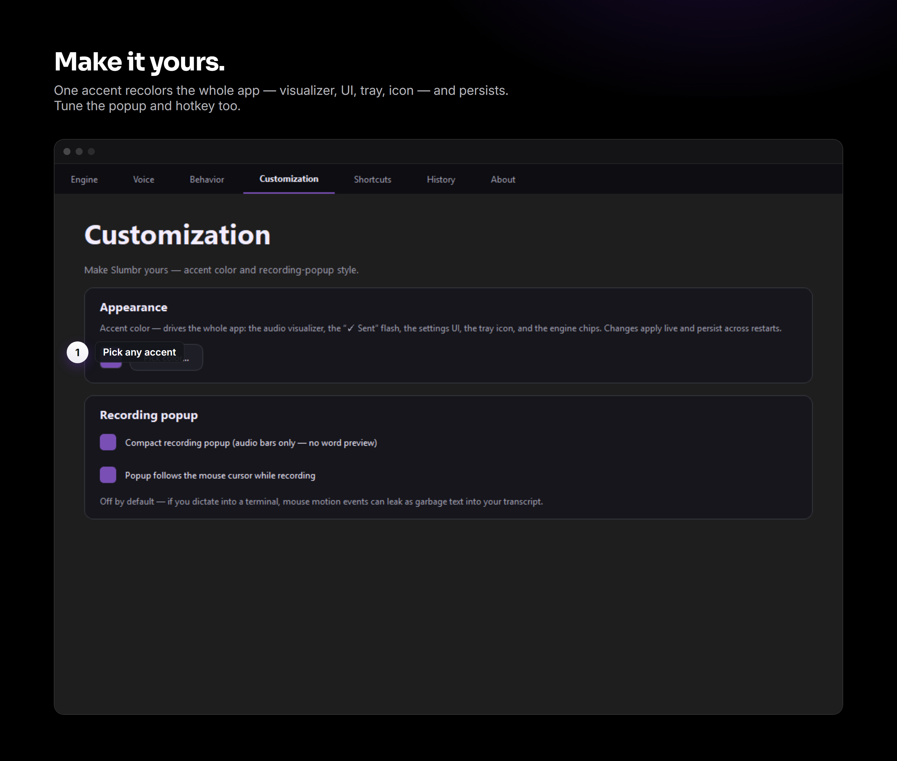

<h1 align="center">Slumbr</h1>

<p align="center">
  
</p>

<p align="center">
  <b>Local, offline, hotkey-driven voice-to-text dictation for Windows.</b><br>
  Tap a key, speak, and your words type into whatever window is focused — fully on-device.
</p>

<p align="center">
  
  
  
  
</p>

Tap **Caps Lock** → a popup appears with a live audio meter and a transcript that grows as you talk → tap **Caps Lock** again → your words land at the cursor. No accounts, no cloud, no telemetry.

## Download

Grab the installer from the **[latest release](https://github.com/SIeepyDev/slumbr/releases/latest)** — **no admin required**, installs to your user folder. Windows 10 / 11 (64-bit).

| Build | Size | For |
| --- | --- | --- |
| **slumbr-setup-cpu.exe** | 95 MB | Any Windows PC — no GPU needed (Moonshine + CPU Whisper). |
| **slumbr-setup-nvidia.exe** | 523 MB | NVIDIA GPUs — adds CUDA acceleration (faster-whisper, `large-v3-turbo`). |

> AMD / Intel GPU users: take the **CPU** build today — a DirectML build is on the roadmap, or [build from source](#build-from-source) for the GPU path now.

## How it works

<p align="center"></p>

<p align="center"></p>

Under the hood, Slumbr runs **two ASR engines** in parallel because Whisper isn't streaming-native:

| Engine | Job | Latency |
| --- | --- | --- |
| Moonshine + Silero VAD + online punctuation (CPU, ONNX int8) | Live popup partials while you speak | ~150–300 ms to first word |
| Your chosen backend (CUDA / DirectML / CPU) | Final transcript when you tap off | ~0.4–1 s for a 5 s clip, hardware-dependent |

Models cache to `%APPDATA%\Slumbr\models` on first download — after that, Slumbr makes **zero network calls** at runtime.

## Features

- **Pluggable STT backends, auto-picked per hardware.** First launch probes your GPU and installs only the right runtime:
  - NVIDIA RTX → `faster-whisper` on CUDA (max accuracy + speed)
  - AMD Radeon RX → Whisper via ONNX Runtime DirectML
  - Intel Arc + iGPU → DirectML (SYCL on roadmap)
  - CPU-only → Moonshine (~150–300 ms, snappier than Whisper on CPU)
- **Live partials while you speak.** Moonshine + Silero VAD + online punctuation give the popup smooth word-by-word text that grows monotonically.
- **Tap-to-toggle Caps Lock hotkey.** No press-and-hold, no wake-word. The OS-level Caps Lock state is never flipped while Slumbr is running. Rebind to any key or chord in Settings → Shortcuts.
- **Auto-paste at the cursor.** Works in Notepad, browsers, chat apps, terminals (Ctrl+Shift+V mode), and Electron IDEs like VS Code.
- **Reverse PTT — two ways:**
  1. **Virtual mic routing** (universal): one-click VB-Cable install + auto-config → call apps hear silence during dictation, Slumbr keeps capturing. Works in Discord / Zoom / Teams / OBS / browser calls.
  2. **Send-keybind hack** (Discord-specific): Slumbr presses a configured keybind during dictation; you bind it to Discord's "Push To Mute" setting.
- **Customizable accent.** One color recolors the whole app — audio visualizer, "✓ Sent" flash, settings UI, tray icon — live, and persists across restarts. (Neutral by default; the brand mark stays monochrome.)
- **System tray + tabbed Settings dialog.** No hub window — the tray is the only persistent UI surface.
- **Transcript history.** Last 30 dictations at `%APPDATA%\Slumbr\history.jsonl`, surfaced in Settings → History and in the tray menu's `Last:` header.
- **Tune everything.** Input device, language, vocabulary hint, paste method, auto-send, hotkey, backend, model size, compute precision, reverse-PTT mode.

## Requirements

- **Windows 10 / 11** (64-bit)
- **GPU optional.** Any of:
  - NVIDIA RTX with CUDA 12.x + driver 560+ (best perf — the NVIDIA installer bundles the CUDA runtime)
  - AMD Radeon RX with a DX12 driver (DirectML — no ROCm needed; source build)
  - Intel Arc or recent Iris/UHD iGPU (DirectML; source build)
  - No GPU — Moonshine runs cleanly on a modern desktop CPU
- ~1–4 GB free disk depending on backend (CPU-only is the smallest)

## Build from source

Prefer the [installer](#download) for daily use. To run from source (e.g. for the AMD/Intel DirectML path, or to hack on it):

```powershell
git clone https://github.com/SIeepyDev/slumbr.git
cd slumbr
.\install.ps1
```

`install.ps1` locates Python 3.10–3.12, creates `.venv`, installs the base runtime, builds the icon, and drops a Slumbr shortcut on your desktop. On first launch, the **setup wizard** probes your hardware and installs the right vendor wheels (~50 MB–1.9 GB depending on backend).

```powershell
.\install.ps1 -Backend nvidia    # pre-bake NVIDIA wheels (skip the wizard's install step)
.\install.ps1 -Backend amd       # pre-bake DirectML wheels
.\install.ps1 -Backend cpu       # pre-bake CPU-only path
.\install.ps1 -Rebuild           # wipe .venv and start clean
```

```powershell
.\.venv\Scripts\pythonw.exe -m slumbr        # no console (matches the shortcut)
.\.venv\Scripts\python.exe -m slumbr --debug # with verbose logs
```

Default hotkey: **Caps Lock** (tap to start, tap to stop).

## Reverse PTT setup

The universal path (recommended):

1. Right-click tray → Settings → **Behavior** tab
2. Under "Virtual mic routing", click **"Install VB-Cable"** (Windows will prompt for admin)
3. Reboot Windows (kernel driver requirement)
4. Re-launch Slumbr → the status flips to "Detected 1 virtual cable"
5. Tick **"Route my mic through a virtual cable"**
6. **In your call apps:** set the microphone to **"CABLE Output (VB-Audio Virtual Cable)"** (note: "Output" — VB-Cable names from the cable's perspective)
7. Keep your *speaker* on your real headphones

Now Caps Lock silences your mic in every call app while Slumbr keeps transcribing internally.

## Privacy

Slumbr never makes a network call at runtime. Models download once from Hugging Face on first launch, cached at `%APPDATA%\Slumbr\models`. Audio buffers live in RAM only and are discarded after transcription. Transcripts persist locally at `%APPDATA%\Slumbr\history.jsonl` (last 30 entries, plain JSON; clear from Settings → History). No accounts, no telemetry, no analytics.

## Troubleshooting

**Paste doesn't work in VS Code's integrated terminal (or Windows Terminal).**
Terminals reserve Ctrl+V. Settings → Behavior → Paste method → **Ctrl+Shift+V**.

**First utterance is slow.**
Warm-up runs at startup; the first *real* transcription still pays a small one-time decoder cost. Subsequent utterances settle into the steady-state range.

**Mic doesn't show up / wrong device picked.**
Settings → Voice → Input device. Slumbr stores names (not numeric indices) so USB-mic hot-plug survives. With VB-Cable installed, **don't pick CABLE Output as your mic** — that's the cable's loopback side, not your real mic.

**Discord (or another call app) doesn't hear me.**
Verify Settings → Behavior → "Route my mic through a virtual cable" is on AND the device dropdown shows the right cable. In Discord, the mic must be **"CABLE Output (VB-Audio Virtual Cable)"** — counterintuitive name, but correct. The log at `%APPDATA%\Slumbr\logs\slumbr.log` shows `MicMirror started …` when routing is live.

## Limitations

- **Windows-only.** WASAPI, the Win32 hotkey hook, and Windows clipboard APIs aren't abstracted.
- **Reverse PTT needs VB-Cable** for the universal path. The Discord-PTM hack works without it but only in Discord.
- **First-run model downloads** total 200 MB – 3 GB depending on backend; not feasible fully offline.
- **Moonshine is English-only.** Non-English users are routed to a Whisper backend automatically.

## License

MIT — see [LICENSE](LICENSE).

---

<p align="center">Built by <a href="https://github.com/SIeepyDev">Sleepy Productions</a>.</p>
